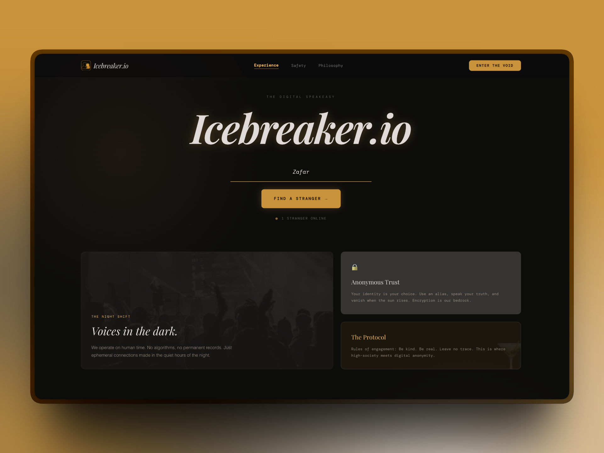

# Icebreaker.io



Anonymous stranger matching. Turn-based. Disappears when it's over.

Built for the TestSprite Season 2 Hackathon.

Demo video: https://youtu.be/mOng0kLfNfI

---

## What it is

Two strangers are matched anonymously. They get three multiple-choice questions. If they pick the same answer on all three rounds, they connect. One mismatch and it's over. No names are revealed until the final match screen.

The entire session is ephemeral. No accounts, no message history, no stored data. When you leave, you're gone.

---

## How it works

- User enters an alias and optional contact details (Instagram, LinkedIn, or email)
- They enter the matchmaking queue over a persistent WebSocket connection
- When two users are queued, the server pairs them into a room and sends the first question
- Each user answers privately — neither can see the other's answer until both have submitted
- The server resolves each round, reveals both answers simultaneously, and either advances or ends the session
- If all three rounds match: both users are shown each other's username and optionally their contact details
- If any round mismatches: the session ends immediately with a "gone" screen

---

## Tech stack

**Frontend**
- React 18 with TypeScript
- Vite
- React Router v6
- Socket.io client
- CSS Modules

**Backend**
- Node.js with TypeScript
- Express
- Socket.io
- tsx (for development hot reload)

**Monorepo**
- Root `package.json` runs both servers concurrently via `concurrently`

---

## Project structure

```
icebreaker-io/
  backend/
    src/
      socket/         # Socket.io event handlers
      services/       # Matchmaking, session logic, question bank
      types/          # Shared TypeScript interfaces
      index.ts        # Express + Socket.io server entry
  frontend/
    public/
      favicon.png
    src/
      components/     # All React page components and their CSS modules
      hooks/          # useSocket singleton hook
      types/          # Frontend-facing TypeScript types
      styles.css      # Global CSS variables and resets
      main.tsx
  package.json        # Root monorepo scripts
```

---

## Running locally

**Prerequisites:** Node.js 18+

```bash
# Install dependencies for both workspaces
npm run install:all

# Start backend and frontend concurrently
npm run dev
```

Frontend runs on `http://localhost:5174`  
Backend runs on `http://localhost:3001`

The frontend proxies `/socket.io` and `/api` requests to the backend via Vite's dev proxy, so no CORS configuration is needed during development.

---

## Game logic

Questions are drawn from a bank of 12 MCQ personality prompts. Three are selected at random per session. Each question has four options identified by letters A through D.

Matching rules:
- Both players must select the same option in a given round for it to count as a match
- All three rounds must match for a connection
- A single mismatch ends the game immediately
- Answers are only revealed after both players have submitted — there is no way to see the other player's answer in real time

On a connected outcome, each player can optionally share their saved contact details. Sharing is opt-in and toggled individually on the result screen.

---

## Identity protocol

Before entering the queue, users are prompted to save a contact handle (Instagram, LinkedIn, or email) and a personal note. This information is stored in `sessionStorage` only — it is never sent to the server.

On a successful match, users can toggle "The Reveal" on the result screen. When enabled, their contact details are displayed unmasked. The information is only as visible as the user chooses to make it.

---

## Design

The interface follows a "Digital Speakeasy" aesthetic — dark surfaces, amber gold accents, serif display type paired with monospace UI text, and glassmorphism panels. The waiting room uses animated orbital rings to communicate that a match is being established.

Design system: `DESIGN.md`

---

## License

MIT
